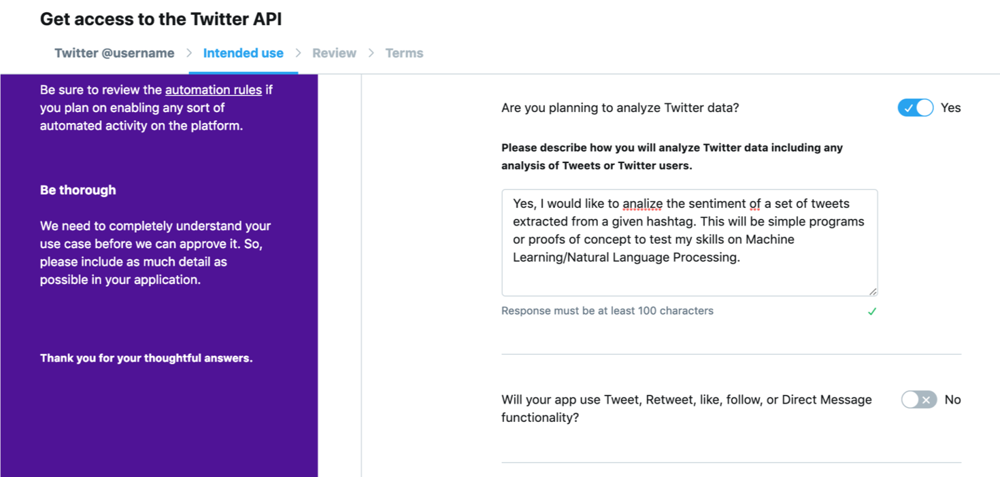
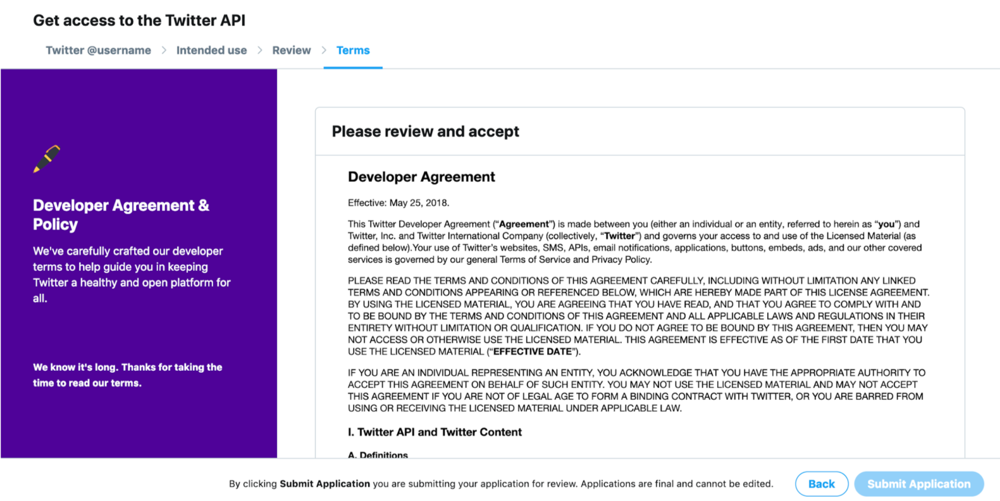

# Cómo crear una cuenta de desarrollador en Twitter 

Para trabajar con la API de Twitter te darás de alta en el programa de desarrolladores (developer program). Tras rellenar una serie de datos obtendrás dos claves únicas: API key, API token. Será necesario disponer de dichas claves para el correcto desarrollo del workshop. 

1. Inicia sesión en tu cuenta de Twitter

1. Indica que quieres explorar la API, dentro de la categoría de “hobbies”

	

1. Confirma tus datos y pulsa _Next_

	

1. Describe en inglés de forma general qué tareas llevarás a cabo utilizando el API de Twitter

	+ _No copies el texto de ejemplo de forma literal. Indica que el objetivo es explorar el API para aplicar algoritmos de Machine Learning, realizar data-mining, análisis de sentimiento  o aprender a limpiar un dataset, por ejemplo._

	

1. A la pregunta _Are you planning to analyze Twitter data" marca _Yes_ 

	

1. Pon ejemplos de qué quieres analizar y cómo. 

	+ _No copies el texto de ejemplo de forma literal. Indica que estás interesado en analizar el sentimiento de un conjunto de tweets que puede ser obtenido por una serie de keywords o a través de un hashtag_

1. Desmarca la cuestión _Will your app use Tweet, Retweet, like, follow or Direct Message functionality_ ya que no utilizaremos funcionalidades relacionadas con retweets ni mensajes directos ni likes en este workshop.

1. Acepta el acuerdo de desarrolladores

	

1. Verifica que te ha llegado un email y haz click en la confirmación del mismo

	

	

1. ¡Enhorabuena! Ya tienes tu cuenta de desarrollador activada. 

	+ _Nota: Si no recibes esta respuesta en tu email, es posible que la verificación de tu cuenta de desarrollador vaya a tardar hasta 24h-48h en procesarse. Esto sucede cuando la descripción o detalles de la app se han redactado de la misma forma (copiado) en varias ocasiones o, a veces, si te acabas de crear el mismo día una cuenta de Twitter y aplicas a desarrollador._

[Siguiente paso: Cómo obtener tus API keys de Twitter](./twitter-app.html)

[Volver a inicio](./)
