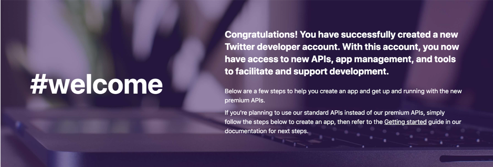
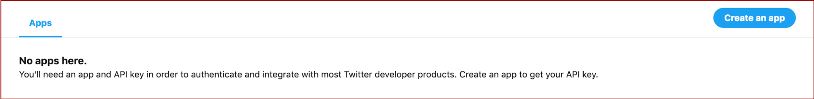
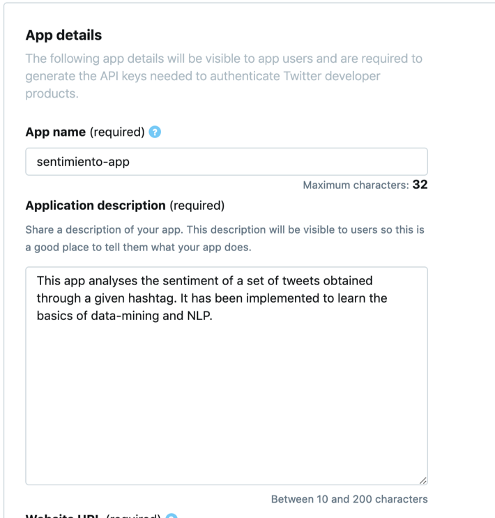
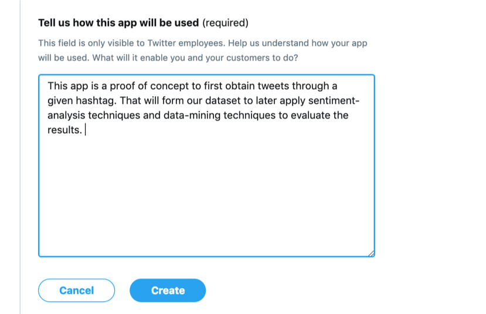
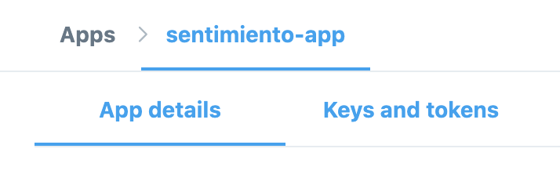
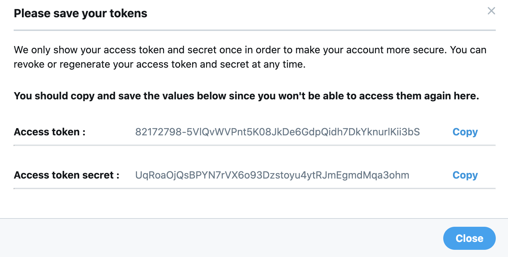

# Cómo obtener tus API keys de Twitter

Una vez Twitter te ha otorgado acceso a su portal de desarrolladores, llega el momento de crear la primera aplicación para generar las claves.

1. Dirígete a [https://developer.twitter.com/en/apps](https://developer.twitter.com/en/apps) y pulsa en _Create an app_

	

	

1. Para crear la app necesitarás darle un nombre, una descripción, una URL y explicar cómo será utilizada. Recuerda que, en este caso, *la principal funcionalidad será la de extraer tweets y analizar su sentimiento*. Para la URL que te piden puedes poner tu propio Twitter.

	

	+ _No copies el texto de ejemplo de forma literal. Indica que estás interesado en analizar el sentimiento de un conjunto de tweets y que los fines son no comerciales, practicar y aprender Machine Learning utilizando como fuente los datos de Twitter._

	

	¡Enhorabuena! Ya tienes tu app, podrás encontrarla en el siguiente listado siempre que tu sesión esté iniciada 
	[https://developer.twitter.com/en/apps](https://developer.twitter.com/en/apps)

1. El siguiente paso consiste en conseguir las _API keys_ que te permitirán descargar los _tweets_ en tiempo real. Para ello haz click en la aplicación que has creado y diríguete a la pestaña _Keys and Tokens_

	

1. En esta sección encontrará las claves únicas que permiten contectarte a Twitter a través de tu aplicación y usuario. Son secretas, por lo que sólo deberán aparecer en tu código fuente exclusivamente cuando vayas a descargar _tweets_ de la red social.

	

	De todas formas, si ha pasado cierto tiempo o ya no vas a usar tus claves, se pueden generar o revocar respectivamente en esta misma sección pulsando en _Regenerate_ o _revoke_.

	

1. Recuerda que necesitarás estas claves para el siguiente paso del workshop.

[Volver a inicio](./)

